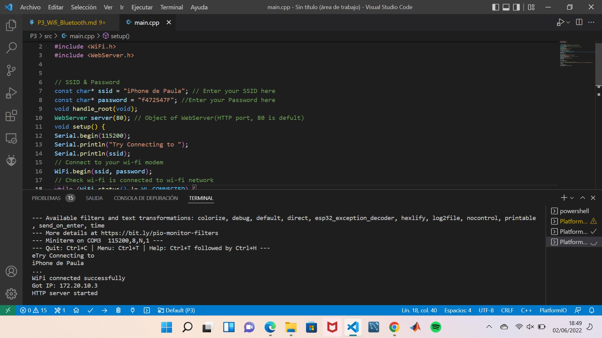

# **PRÀCTICA 3: WI-FI I BLUETOOTH**
## **PART A: Generació d'una pàgina web**
## **3.1 codi**
```c++

    #include <Arduino.h>  
    #include <WiFi.h>  
    #include <WebServer.h>  


    // SSID & Password  
    const char* ssid = "iPhone de Paula";  // Enter your SSID here  
    const char* password = "f472547F";  //Enter your Password here
    void handle_root(void);  
    WebServer server(80);  
    // Object of WebServer(HTTP port, 80 is defult)  


    void setup() {  
        Serial.begin(115200);  
        Serial.println("Try Connecting to ");
        Serial.println(ssid);
        // Connect to your wi-fi modem
        WiFi.begin(ssid, password);
        // Check wi-fi is connected to wi-fi network  
        while (WiFi.status() != WL_CONNECTED){
            delay(1000);
            Serial.print(".");
        }
        Serial.println("");  
        Serial.println("WiFi connected successfully");  
        Serial.print("Got IP: ");  
        Serial.println(WiFi.localIP());  
        //Show ESP32 IP on serial  
        server.on("/", handle_root);  
        server.begin();  
        Serial.println("HTTP server started");  
        delay(100);  
    }

    void loop() { 
        server.handleClient();  
    }

    // HTML & CSS contents which display on web server

    String HTML = <!DOCTYPE html><html><body><h1>My Primera Pagina con ESP32 - Station Mode &#128522;</h1></body></html>;
       
    // Handle root url (/)  
    void handle_root() { 
        server.send(200, "text/html", HTML);  
    }

```

## **3.2 Funcionament**
El programa permet que el ESP32 es connecti al wifi, en aquest cas del meu telèfon mòbil 'iPhone de Paula' i generi una web senzilla. Per tal que funcioni el programa, l'ordinador, ha d'estar connectat al mateix wifi.
Al principi es declaren el nom de la xarxa (ssid) i la contrasenya d'aquesta(pasword) com a caràcters constants.  

Seguidament, al setup és connectarà al wifi mitjançant la comanada WiFi.begin(ssid, password); i es comprovarà si està connectat a la xarxa amb el bucle while (WiFi.status() != WL_CONNECTED). És llavors que obtindrem la IP on es trobarà la web utilitzant WiFi.localIP().  

A partir d'aquí el que fa és que un cop connectat al wifi genera una adreça IP que rebrem per pantalla. És doncs que si copiem la adreça IP al buscador de Google se'ns obrirà una pàgina web senzilla en la qual ens apareixerà el missatge "My primera pagina con ESP32" que s'aconseguirà amb la part del codi que fa servir HTML.



## **PART B: Comunicació bluetooth amb el mobil**
## **3.3 Codi**
```c++
#include "BluetoothSerial.h" 

#if !defined(CONFIG_BT_ENABLED) || !defined(CONFIG_BLUEDROID_ENABLED)  
#error Bluetooth is not enabled! Please run `make menuconfig` to and enable it
#endif  

BluetoothSerial SerialBT;  

void setup() {
     Serial.begin(115200);  
     SerialBT.begin("ESP32test"); //Bluetooth device name  
     Serial.println("The device started, now you can pair it with bluetooth!");  
}  

void loop() { 
    
    if (Serial.available()) { 
       SerialBT.write(Serial.read());  
    } 

    if (SerialBT.available()) { 
        Serial.write(SerialBT.read());  
    } 
    delay(20);  
}
```
## **3.4 Funcionament**
Aquesta pràctica consisteix a poder veure la comunicació bluetooth, entre un dispositiu bluetooth que actuarà en aquest cas d'esclau rebent missatges que rebrà des d'un dispositiu mòbil, des d'on s'enviaran aquests missatges. Per això inicialment necessitem inicialitzar la nostra ESP32 perquè aquesta sigui capaç de rebre els missatges. Per això executarem el codi que un cop pujat a la placa ens permetrà aparellar-la amb el nostre dispositiu mòbil

Per poder escriure es necessari tenir en el distositiu descarregada la seguent aplicació: Serial bluetooth terminal.

Per connectar els nostres dispositius, primer obrim l'aplicació i en l'apartat de devices ens sortirà el nom de la nostra placa "ESP32test". Quan us donem els nostres dispositius queden aparellats i se'ns obre un terminal on podem escriure.

Quan escrivim des del dispositiu mòbil un missatge, aquest també es mostrarà per la pantalla de l'ordinador mentre monitori i anem enviant missatges.
